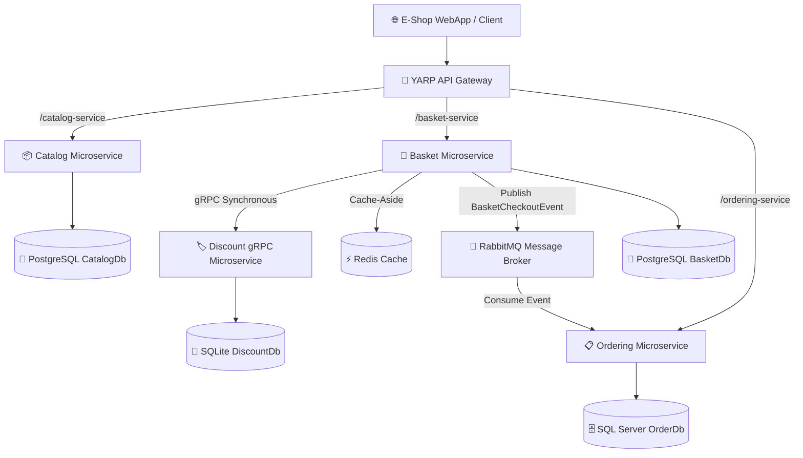

# 🛒 E-Shop Microservices Application

[](https://dotnet.microsoft.com/)
[](https://www.docker.com/)
[](https://www.postgresql.org/)
[](https://redis.io/)
[](https://www.microsoft.com/sql-server)
[](https://www.rabbitmq.com/)
[](https://grpc.io/)
[](https://microsoft.github.io/reverse-proxy/)

An enterprise-grade, event-driven **E-Commerce Microservices Application** built with **.NET**, implementing modern architectural patterns such as **CQRS**, **Domain-Driven Design (DDD)**, **Clean Architecture**, and **Event-Driven Asynchronous Communication**.

---

## 📋 Table of Contents

- [Architecture Overview](#-architecture-overview)
- [Microservices & Components](#-microservices--components)
- [Design Patterns & Principles](#-design-patterns--principles)
- [Tech Stack](#-tech-stack)
- [Services & Port Mapping](#-services--port-mapping)
- [Getting Started](#-getting-started)
  - [Prerequisites](#prerequisites)
  - [Running with Docker Compose](#running-with-docker-compose)
  - [Running via Visual Studio](#running-via-visual-studio)
- [API Gateway Routing](#-api-gateway-routing)
- [Health Checks](#-health-checks)

---

## 🏗️ Architecture Overview

The system is designed following the **Database-per-Service** pattern to ensure loose coupling, high availability, and independent scalability.



---

## 🧩 Microservices & Components

### 1. 📦 **Catalog.API**
- **Domain**: Manages product items, categories, and inventory details.
- **Data Store**: PostgreSQL via **Marten** (Document Database).
- **Features**: Product CRUD operations, filtering by category/ID, paginated product retrieval, health checks.

### 2. 🛒 **Basket.API**
- **Domain**: Handles customer shopping carts and items.
- **Data Store**: PostgreSQL (Marten Document DB) + **Redis** Distributed Cache.
- **Integration**:
  - **gRPC Client**: Interacts with `Discount.gRPC` synchronously to calculate product discounts upon item addition.
  - **Event Publishing**: Publishes `BasketCheckoutEvent` to **RabbitMQ** via **MassTransit** when checkout occurs.
- **Patterns**: Cache-Aside pattern implemented with **Scrutor** (`CachedBasketRepository` decorator).

### 3. 🏷️ **Discount.gRPC**
- **Domain**: Manages promotional coupons and discounts.
- **Data Store**: SQLite with **Entity Framework Core**.
- **Communication**: High-performance **gRPC** server interface consumed by Basket.API.

### 4. 📋 **Ordering Microservice**
- **Domain**: Complete order management lifecycle.
- **Architecture**: **Clean Architecture** + **Domain-Driven Design (DDD)**.
  - `Ordering.Domain`: Aggregate roots (`Order`), Entities (`OrderItem`), Value Objects (`Address`, `Payment`), Domain Events.
  - `Ordering.Application`: MediatR Commands/Queries, Handlers, DTOs, MassTransit Consumers (`BasketCheckoutConsumer`).
  - `Ordering.Infrastructure`: Entity Framework Core, SQL Server DB Context, EF Interceptors (`AuditableEntityInterceptor`, `DispatchDomainEventsInterceptor`), Database Migrations.
  - `Ordering.API`: Carter Minimal API endpoints for Order management.
- **Data Store**: Microsoft SQL Server.

### 5. 🚪 **API Gateway (YARP)**
- **Technology**: **YARP (Yet Another Reverse Proxy)**.
- **Features**: Reverse routing to downstream microservices, request rate limiting, centralized entry point for clients.

### 6. 🖥️ **E-Shop.Web**
- **Technology**: ASP.NET Core Web App (Razor Pages / MVC).
- **Integration**: Strongly-typed HTTP API consumption using **Refit** communicating through the YARP API Gateway.

### 7. 🧱 **BuildingBlocks & Messaging**
- `BuildingBlocks`: Shared abstractions for CQRS (`ICommand`, `IQuery`), MediatR Pipeline Behaviors (`LoggingBehavior`, `ValidationBehavior`), Custom Exception Handling, and Pagination models.
- `BuildingBlocks.Messaging`: Shared integration events (`BasketCheckoutEvent`) and **MassTransit** RabbitMQ extension configurations.

---

## 📐 Design Patterns & Principles

- **CQRS (Command Query Responsibility Segregation)**: Implemented using **MediatR** across microservices.
- **Clean Architecture & DDD**: Strict separation of concerns (Domain, Application, Infrastructure, API layers) in Ordering Microservice.
- **Minimal APIs**: Clean, lightweight endpoint routing powered by **Carter**.
- **Event-Driven Architecture**: Asynchronous integration event handling using **MassTransit** and **RabbitMQ**.
- **Cache-Aside Pattern**: High-speed basket retrieval using **Redis** decorated with **Scrutor**.
- **API Gateway Pattern**: Unified request entry point via **YARP Reverse Proxy**.
- **Cross-Cutting Concerns**: Handled via MediatR Pipeline Behaviors (FluentValidation, Serilog/Logging) and global exception handlers.

---

## 🛠️ Tech Stack

| Category | Technology / Library |
| :--- | :--- |
| **Framework** | .NET 10 / .NET 8+ |
| **Architectural Patterns** | Microservices, CQRS, DDD, Clean Architecture, Event-Driven |
| **Libraries** | MediatR, Carter, Mapster, FluentValidation, Scrutor, Refit |
| **Databases & ORM** | PostgreSQL (Marten Document DB), Redis, SQL Server (EF Core), SQLite |
| **Messaging & RPC** | RabbitMQ (MassTransit), gRPC (Protobuf) |
| **Gateway & Web** | YARP Reverse Proxy, ASP.NET Core Razor Pages |
| **Containers & Tools** | Docker, Docker Compose, Health Checks UI |

---

## 🔌 Services & Port Mapping

| Service | Container Name | Host Port (HTTP / HTTPS) | Internal Port | Environment / DB |
| :--- | :--- | :--- | :--- | :--- |
| **Catalog DB** | `catalogdb` | `5432` | `5432` | PostgreSQL 16 |
| **Basket DB** | `basketdb` | `5433` | `5432` | PostgreSQL 16 |
| **Distributed Cache** | `distributedcash` | `6379` | `6379` | Redis |
| **Order DB** | `orderdb` | `14333` | `1433` | SQL Server |
| **RabbitMQ** | `messagebroker` | `5672` / `15672` | `5672` / `15672` | RabbitMQ + Management UI |
| **Catalog.API** | `catalog.api` | `6000` / `6060` | `8080` / `8081` | ASP.NET Core API |
| **Basket.API** | `basket.api` | `6001` / `6061` | `8080` / `8081` | ASP.NET Core API |
| **Discount.gRPC** | `discount.grpc` | `6002` / `6062` | `8080` / `8081` | gRPC Service |
| **Ordering.API** | `ordering.api` | `6003` / `6063` | `8080` / `8081` | ASP.NET Core API |
| **API Gateway** | `apigetway` | `6004` / `6064` | `8080` / `8081` | YARP Gateway |
| **E-Shop Web** | `e-shop.web` | `6005` / `6065` | `8080` / `8081` | ASP.NET Core Web App |

---

## 🚀 Getting Started

### Prerequisites

- [.NET 8.0 SDK](https://dotnet.microsoft.com/download) or higher
- [Docker Desktop](https://www.docker.com/products/docker-desktop/)

### Running with Docker Compose

1. **Clone the repository**:
   ```bash
   git clone https://github.com/OmarHany10/E-Shop-Microservice-.git
   cd E-Shop-Microservice-
   ```

2. **Spin up all containers**:
   ```bash
   docker-compose up -d
   ```

3. **Verify running containers**:
   ```bash
   docker ps
   ```

4. **Access Applications**:
   - **E-Shop Web App**: `http://localhost:6005`
   - **API Gateway**: `http://localhost:6004`
   - **RabbitMQ Management Dashboard**: `http://localhost:15672` *(User: `guest` / Pass: `guest`)*

### Running via Visual Studio

1. Open `Micro.slnx` or `Micro.sln` in **Visual Studio 2022+**.
2. Set `docker-compose` as the **Startup Project**.
3. Press `F5` to build and run all services in containerized mode.

---

## 🔀 API Gateway Routing

All client HTTP requests can be routed through the **YARP API Gateway** (`http://localhost:6004`):

- **Catalog Microservice**: `http://localhost:6004/catalog-service/...`
- **Basket Microservice**: `http://localhost:6004/basket-service/...`
- **Ordering Microservice**: `http://localhost:6004/ordering-service/...`

---

## ❤️ Health Checks

Each microservice includes ASP.NET Core Health Checks monitoring database connectivity and dependent services:

- **Catalog Health Check**: `/health`
- **Basket Health Check**: `/health`
- **Ordering Health Check**: `/health`

